# Sketchy
Sketch inversion using DCNNs (_synthesising photo-realistic images from pencil sketches_) following the work of [Convolutional Sketch Inversion][conv_paper] and [Scribbler][scribbler]. 

This project is mainly focused on sketches of human faces and architectural drawings of buildings. However according to [Scribbler][scribbler] and the followed experimentation with their proposed framework, it is possible that given a large dataset and ample training time, this network could generalize to other categories as well. 

The model has been trained using a dataset generated from a large database of face images, and then the network was fine-tuned to fit the purpose of architectural sketches.

## Results
### Faces
<table>
<tr>
<td align="center">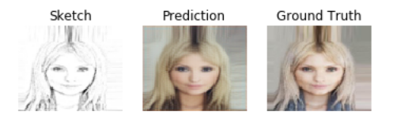</td>
<td align="center">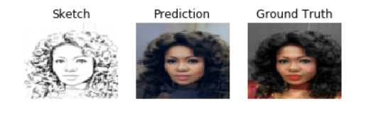</td>
</tr>
<tr>
<td align="center">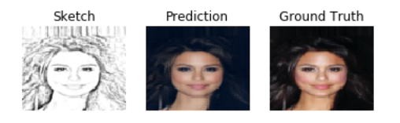</td>
<td align="center">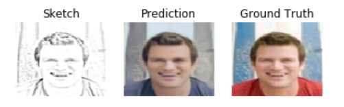</td>
</tr>
</table>

### Buildings
<table>
<tr>
<td align="center">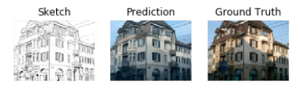</td>
<td align="center">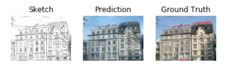</td>
</tr>
<tr>
<td align="center">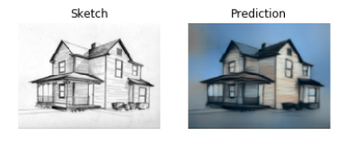</td>
<td align="center">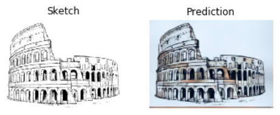</td>
</tr>
</table>

## Datasets
- [*Large-scale CelebFaces Attributes (CelebA) dataset*][celeba].
- [*ZuBuD Image Database*][zubud].
- [*CUHK Face Sketch (CUFS) database*][cuhk]
- Building sketches from *Google Images* for testing

## Sketching
The datasets were simulated, i.e. the sketches were generated, using the following methods (with the exception of the CUHK dataset, which contains sketches and the corresponding images)
- [Pencil Sketchify][pencil]
- [XDoG (Extended Difference of Gaussians)][xdog] 
- [Neural Style Transfer][style_transfer]

Furthermore, due to the low number of images of buildings available, various augmentations on the ZuBuD dataset were applied to produce more images using the following [image augmentation tool][tool]

## Network Architecture 

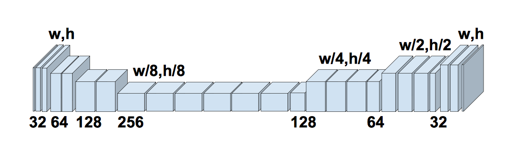

The network architecture used in [Scribbler][scribbler] was used. The generator follows an encoder-decoder design, with down-sampling steps, followed by residual layers, followed by up-sampling steps.

## Loss Functions 
The Loss function was computed as the weighted average of three loss functions; namely: pixel loss, total variation loss, and feature loss. 

The pixel loss was computed as:

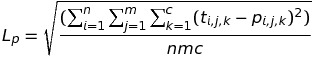

Where t is the true image, p is the predicted image, and n,m,c are the height, width, and number of color channels respectively.

The feature loss was computed as:

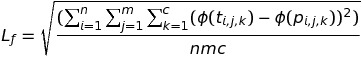

The total variation loss was used to encourage smoothness of the output, and was computed as

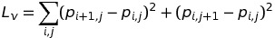

Where *phi(x)* is the output of the fourth layer in a pre-trained model (VGG16 relu\_2\_2) to feature transform the targets and predictions.

The total loss is then computed as

<i>Lt = wpLp + wfLf + wvLv</i>

For the present application, *wf = 0.001, wp = 1, wv = 0.00001*
## Pretrained weights
- Face [Weights][w1] after training the network on the CelebA dataset using the Pencil Sketchify method
- Building [Weights][w2] after fine-tuning the network for the building sketches using the augmented ZuBuD dataset with the Pencil Sketchify method

## Todo
- Training with a larger building dataset using a variety of sketch styles to improve the generality of the network
- Adding adversarial loss to the network.
- Using sketch anti-roughing to unify the styles of
the training and input sketches.
- Passing the sketch results to a super-resolution network to improve image clarity.
- Increasing the image size of the training data. 

## References
[Sketchback](https://github.com/BKHMSI/Sketchback)

[//]: # (These are reference links used in the body of this note and get stripped out when the markdown processor does its job. There is no need to format nicely because it shouldn't be seen. Thanks SO - http://stackoverflow.com/questions/4823468/store-comments-in-markdown-syntax)

[celeba]: <http://mmlab.ie.cuhk.edu.hk/projects/CelebA.html>
[zubud]: <http://www.vision.ee.ethz.ch/showroom/zubud/>
[cuhk]: <http://www.ee.cuhk.edu.hk/~jshao/CUHKcrowd_files/cuhk_crowd_dataset.htm>
[poster]: https://github.com/BKHMSI/architecture_sketch_inversion
[xdog]: <http://www.sciencedirect.com/science/article/pii/S009784931200043X>
[pencil]: <PencilSketch>
[style_transfer]: <https://github.com/titu1994/Neural-Style-Transfer>
[tool]: <https://codebox.net/pages/image-augmentation-with-python>
[conv_paper]: <https://arxiv.org/abs/1606.03073>
[scribbler]: <https://arxiv.org/abs/1612.00835>
[w1]: <https://drive.google.com/file/d/0B-HY3igdAAMNemRpZHc2SkVIV2s/view?usp=sharing>
[w2]: <https://drive.google.com/file/d/0B-HY3igdAAMNajljMGVObDJwOTA/view?usp=sharing>
